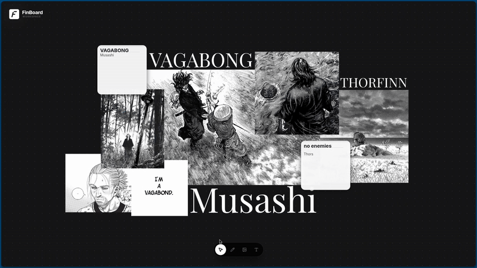

<div align="center">
  
  <h1>FinBoard</h1>
  <p>
    <strong>Tu espacio de trabajo visual definitivo.</strong>
  </p>

  <!-- Badges -->
  <p>
    
    
    
  </p>
  <p>
    
    
    
    
    
  </p>
</div>

---

## Descripción 

**FinBoard** es una aplicación de pizarra digital de alto rendimiento diseñada para la productividad y la creatividad. Proporciona un lienzo infinito donde los usuarios pueden organizar ideas, gestionar proyectos y visualizar conceptos. Su arquitectura garantiza rapidez y fluidez, integrando herramientas esenciales en una interfaz moderna y minimalista.

<br>
<div align="center">
  
  <p><em>Vista general del espacio de trabajo</em></p>
</div>
<br>

## Funcionalidades

*   **Notas Adhesivas Inteligentes**: Creación y edición de notas con soporte para formato de texto, ideales para brainstorming y organización rápida.
*   **Lienzo Infinito**: Espacio de trabajo ilimitado que permite expandir diagramas y mapas mentales sin restricciones espaciales.
*   **Gestión de Recursos Visuales**: Importación, redimensionamiento y rotación precisa de imágenes para enriquecer el contenido visual.
*   **Herramientas de Dibujo**: Sistema de trazado a mano alzada con suavizado automático para esquematización clara y profesional.
*   **Agrupación y Jerarquía**: Herramientas avanzadas de selección múltiple, agrupación de elementos y control de orden (Z-Order) para una gestión estructurada del contenido.
*   **Persistencia Local**: Guardado automático de todos los cambios en tiempo real, asegurando la integridad de los datos.
*   **Sistema de Historial**: Funcionalidad completa de deshacer y rehacer para un flujo de trabajo flexible y seguro.

---

## Atajos de Teclado y Controles

Optimiza tu flujo de trabajo con estos controles rápidos:

| Acción | Atajo / Control |
| :--- | :--- |
| **Herramientas** | |
| Seleccionar (Cursor) | <kbd>V</kbd> |
| Texto | <kbd>T</kbd> |
| Dibujar | <kbd>D</kbd> |
| **Edición** | |
| Deshacer | <kbd>Ctrl</kbd> + <kbd>Z</kbd> |
| Rehacer | <kbd>Ctrl</kbd> + <kbd>Shift</kbd> + <kbd>Z</kbd> |
| Eliminar Elemento | <kbd>Supr</kbd> / <kbd>Backspace</kbd> |
| Confirmar Texto | <kbd>Enter</kbd> (al editar) |
| Cancelar / Salir | <kbd>Esc</kbd> |
| **Navegación** | |
| Zoom | Rueda del Ratón |
| Panoramizar (Moverse) | Click Central + Arrastrar |
| Selección Múltiple | <kbd>Shift</kbd> + Click |

---

## Requisitos y Dependencias

FinBoard se distribuye como un archivo **AppImage** autocontenido. En la mayoría de los entornos de escritorio modernos (GNOME, KDE, XFCE), la aplicación funcionará de inmediato.

La única dependencia del sistema que comúnmente requiere instalación manual en distribuciones recientes (como Ubuntu 22.04+ o Fedora 38+) es la biblioteca **FUSE (Filesystem in Userspace)** en su versión 2, necesaria para montar el archivo AppImage.

### Guía de Instalación de Dependencias

<details>
<summary><strong>Arch Linux / Manjaro</strong></summary>

```bash
sudo pacman -S fuse2
```
</details>

<details>
<summary><strong>Fedora / CentOS / RHEL</strong></summary>

```bash
sudo dnf install fuse
```
</details>

<details>
<summary><strong>Ubuntu 24.04 / Debian 13 (Trixie) y superiores</strong></summary>

En versiones muy recientes, el paquete ha sido renombrado para gestionar la transición de 64 bits:
```bash
sudo apt update
sudo apt install libfuse2t64
```
</details>

<details>
<summary><strong>Ubuntu 20.04 - 23.10 / Debian 11 - 12</strong></summary>

Para versiones estándar recientes:
```bash
sudo apt update
sudo apt install libfuse2
```
</details>

*Nota: El resto de las bibliotecas gráficas (GTK, ALSA, X11) suelen estar preinstaladas en cualquier distribución orientada al escritorio.*

---

## Descarga e Instalación

Para utilizar FinBoard en su sistema:

1.  Diríjase a la sección **[Releases](../../releases)** del repositorio.
2.  Descargue la última versión del archivo `.AppImage` (ej. `FinBoard-1.0.0.AppImage`).
3.  Otorgue permisos de ejecución al archivo mediante la terminal:

    ```bash
    chmod +x FinBoard-*.AppImage
    ```

4.  Ejecute la aplicación:

    ```bash
    ./FinBoard-*.AppImage
    ```

---

<div align="center">
  <p>Desarrollado por <strong>Diego Ledesma</strong></p>
</div>
